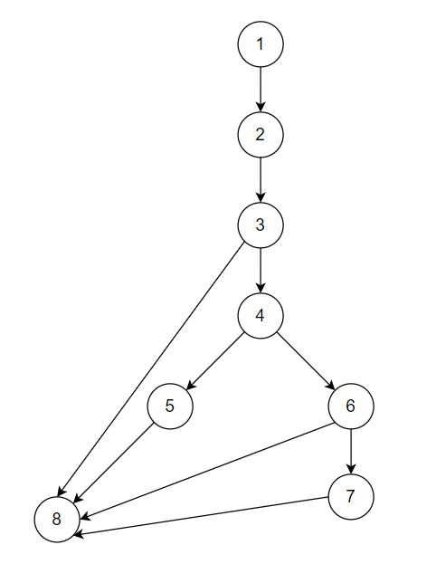
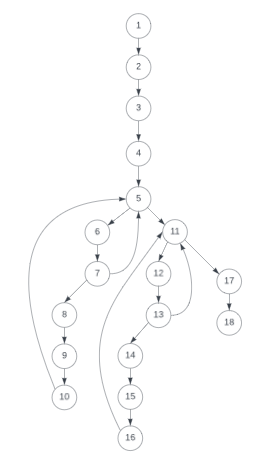
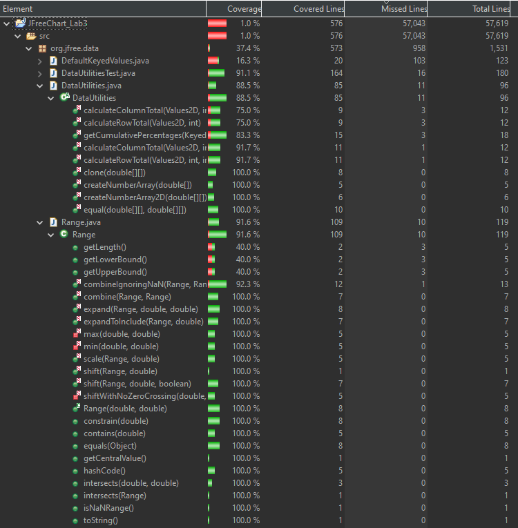
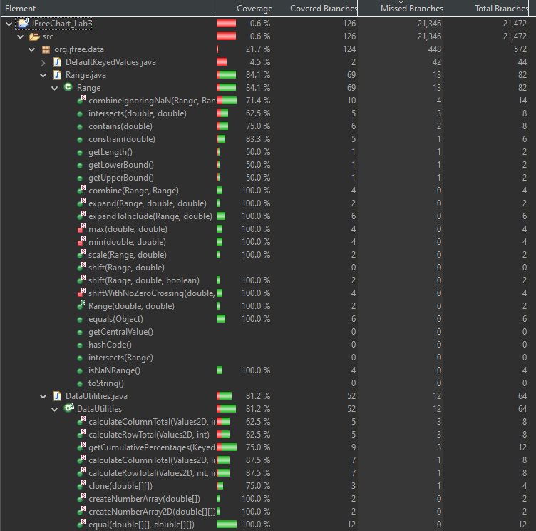
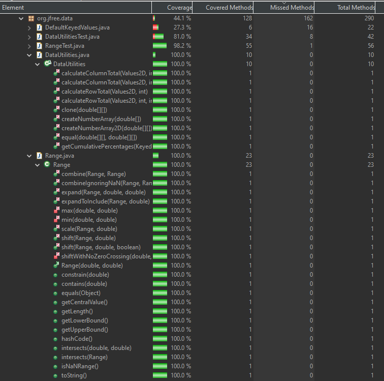

**SENG 637 - Dependability and Reliability of Software Systems**

**Lab. Report #3 – Code Coverage, Adequacy Criteria and Test Case Correlation**

| Group \#:      | 14     |
| -------------- | ------ |
| Student Names: | Paul   |
|                | Matjaz |
|                | Marie  |
|                | Ian    |

(Note that some labs require individual reports while others require one report
for each group. Please see each lab document for details.)

# 1 Introduction

This assignment report covers white box testing of two classes of the JFreeChart library. Data Flow Coverage of the previous assignment tests was manually calculated for two methods. Then test cases were written for all methods to achieve Control Flow Coverage goals.

# 2 Manual data-flow coverage calculations for X and Y methods

## Range.constrain

### Data Flow Graph

### def-use sets per statement

    DEF(1):={value} C-USE:={} P-USE:={}
    DEF(2):={result} C-USE:={value} P-USE:={}
    DEF(3):={} C-USE:={} P-USE:={value}
    DEF(4):={} C-USE:={} P-USE:={value, this}
    DEF(5):={result} C-USE:={this} P-USE:={}
    DEF(6):={} C-USE:={} P-USE:={value, this}
    DEF(7):={result} C-USE:={this} P-USE:={}
    DEF(8):={} C-USE:={result} P-USE:={}

### DU-pairs

| Variable | du-pairs             |
| -------- | -------------------- |
| value    | (1,2)(1,3)(1,4)(1,6) |
| result   | (2,8)(5,8)(7,8)      |

### DU-pair coverage

| Test Case                                        | Variable | Covered du-pairs     | \# Covered | \# Total | Coverage |
| ------------------------------------------------ | -------- | -------------------- | ---------- | -------- | -------- |
| constrain_ValueAboveUpperBound_ReturnsUpperBound | value    | (1,2)(1,3)(1,4)      | 3          | 4        | 75%      |
|                                                  | result   | (5,8)                | 1          | 3        | 33.33%   |
| Total                                            |          |                      | 4          | 7        | 57.14%   |
| constrain_ValueUpperBound_ReturnsUpperBound      | value    | (1,2)(1,3)           | 2          | 4        | 50%      |
|                                                  | result   | (2,8)                | 1          | 3        | 33.33%   |
| Total                                            |          |                      | 3          | 7        | 42.86%   |
| constrain_ValueBelowUpperBound_ReturnsInputValue | value    | (1,2)(1,3)           | 2          | 4        | 50%      |
|                                                  | result   | (2,8)                | 1          | 3        | 33.33%   |
| Total                                            |          |                      | 3          | 7        | 42.86%   |
| constrain_ValueBetweenBounds_ReturnsInputValue   | value    | (1,2)(1,3)           | 2          | 4        | 50%      |
|                                                  | result   | (2,8)                | 1          | 3        | 33.33%   |
| Total                                            |          |                      | 3          | 7        | 42.86%   |
| constrain_ValueAboveLowerBound_ReturnsInputValue | value    | (1,2)(1,3)           | 2          | 4        | 50%      |
|                                                  | result   | (2,8)                | 1          | 3        | 33.33%   |
| Total                                            |          |                      | 3          | 7        | 42.86%   |
| constrain_ValueLowerBound_ReturnsLowerBound      | value    | (1,2)(1,3)           | 2          | 4        | 50%      |
|                                                  | result   | (2,8)                | 1          | 3        | 33.33%   |
| Total                                            |          |                      | 3          | 7        | 42.86%   |
| constrain_ValueBelowLowerBound_ReturnsLowerBound | value    | (1,2)(1,3)(1,4)(1,6) | 4          | 4        | 100%     |
|                                                  | result   | (7,8)                | 1          | 3        | 33.33%   |
| Total                                            |          |                      | 5          | 7        | 71.43%   |

## DataUtilities.calculateColumnTotal

### Data Flow Graph

### def-use sets per statement

    DEF(1):={data, column} C-USE:={} P-USE:={}
    DEF(2):={} C-USE:={data} P-USE:={}
    DEF(3):={total} C-USE:={} P-USE:={}
    DEF(4):={rowCount} C-USE:={data} P-USE:={}
    DEF(5):={r} C-USE:={} P-USE:={rowCount}
    DEF(6):={n} C-USE:={data, r, column} P-USE:={}
    DEF(7):={} C-USE:={} P-USE:={n}
    DEF(8):={total} C-USE:={n} P-USE:={}
    DEF(9):={} C-USE:={} P-USE:={}
    DEF(10):={} C-USE:={} P-USE:={}
    DEF(11):={r2} C-USE:={} P-USE:={rowCount}
    DEF(12):={n} C-USE:={data, r2, column} P-USE:={}
    DEF(13):={} C-USE:={} P-USE:={n}
    DEF(14):={total} C-USE:={n} P-USE:={}
    DEF(15):={} C-USE:={} P-USE:={}
    DEF(16):={} C-USE:={} P-USE:={}
    DEF(17):={} C-USE:={total} P-USE:={}
    DEF(18):={} C-USE:={} P-USE:={}

### DU-pairs

| Variable | du-pairs                 |
| -------- | ------------------------ |
| data     | (1,2)(1,4)(1,6)(1,12)    |
| column   | (1,6)(1,12)              |
| total    | (3,17)(8,17)(14,17)      |
| rowCount | (4,5)(4,11)              |
| r        | (5,5)(5,6)               |
| n        | (6,7)(6,8)(12,13)(12,14) |
| r2       | (11,11)(11,12)           |

### DU-pair coverage

| Test Case                          | Variable | Covered du-pairs | \# Covered | \# Total | Coverage |
| ---------------------------------- | -------- | ---------------- | ---------- | -------- | -------- |
| calculateColumnTotal_WithTwoValues | data     | (1,2)(1,4)(1,6)  | 3          | 4        | 75%      |
|                                    | column   | (1,6)            | 1          | 2        | 50%      |
|                                    | total    | (3,17)(8,17)     | 2          | 3        | 67%      |
|                                    | rowCount | (4,5)(4,11)      | 2          | 2        | 100%     |
|                                    | r        | (5,5)(5,6)       | 2          | 2        | 100%     |
|                                    | n        | (6,7)(6,8)       | 2          | 4        | 50%      |
|                                    | r2       | (11,11)          | 1          | 2        | 50%      |
| Total                              |          |                  | 13         | 19       | 68%      |

The remaining test cases for calculatedColumnTotal tested exception types and thus are not included here.

# 3 A detailed description of the testing strategy for the new unit test

Using EclEmma, our coverage metrics are line, branch and method. The minimum coverage goals are:

- 90% line coverage

- 70% branch coverage

- 100% method coverage

Our plan is to examine each method and develop test cases to primarily meet the line coverage goal. Once those tests are written, branch coverage will be assessed and test cases will be added to meet the branch coverage goal if necessary. The Javadocs are to be used for developing the test oracles.

## DataUtilities

### equal(double [][] a, double [][] b)

- TC1= <a=null, b=null> Should return true
- TC2= <a=null, b={{-6.5, 15.2},{3.8, 8.4}}> Should return false
- TC3= <a={{-6.5, 15.2},{3.8, 8.4}}, b=null> Should return false
- TC4= <a={{-6.5, 15.2},{3.8, 8.4}}, b={{-6.5, 15.2},{3.8, 8.4}}> Should return true
- TC5= <a={{-6.5, 15.2},{3.8, 8.4}}, b={{1,2,3},{4,5,6}}> Should return false
- TC6= <a={{-6.5, 15.2},{3.8, 8.4}}, b={{1,2,3,4}}> Should return false

### clone(double [][] source)

- TC1= <source=null> Should throw IllegalArgumentException
- TC2= <source={{-6.5, 15.2},{3.8, 8.4}}> Should return {{-6.5, 15.2},{3.8, 8.4}}

### calculateColumnTotal(Values2D data, int column, int[] validRows)

- TC1= <data=mock Values2D object, column=0, validRows={1,2}> Should return -0.5
- TC2= <data=mock Values2D object with zero rows, column=0, validRows={1,2}> Should return 0
- TC3= <data=mock Values2D object with some values as null in the valid rows, column=1, validRows={1,2}> Should return 7.1
- TC4= <data=null, column=0, validRows={1,2}> Should throw IllegalArgumentException

### calculateColumnTotal(Values2D data, int column)

- TC1= <data=mock Values2D object, column=0> Should return 17.7
- TC2= <data=mock Values2D object with zero rows, column=0> Should return 0
- TC3= <data=mock Values2D object with some values as null, column=1> Should return 13.8
- TC4= <data=null, column=0> Should throw IllegalArgumentException

### calculateRowTotal(Values2D data, int row, int[] validCols)

- TC1= <data=mock Values2D object, row=1, validCols={0,2}> Should return 0
- TC2= <data=mock Values2D object with zero columns, row=1, validCols={0,2}> Should return 0
- TC3= <data=mock Values2D object with some values as null in the valid columns, row=3> Should return 10.7
- TC4= <data=null, row=0, validCols={0,2}> Should throw IllegalArgumentException

### calculateRowTotal(Values2D data, int row)

- TC1= <data=mock Values2D object, row=0> Should return 23.5
- TC2= <data=mock Values2D object with zero columns, row=0> Should return 0
- TC3= <data=mock Values2D object with some values as null, row=2> Should return 7.0
- TC4= <data=null, row=0> Should throw IllegalArgumentException

### createNumberArray(double[] data)

- TC1= <data={10.5, -6.7}> Should return a Number array containing {10.5, -6.7}
- TC2= <data=null> Should throw IllegalArgumentException

### createNumberArray2D(double[][] data)

- TC1= <data={{-6.5, 15.2},{3.8, 8.4}}> Should return a Number array containing {{-6.5, 15.2},{3.8, 8.4}}
- TC2= <data=null> Should throw IllegalArgumentException

### getCumulativePercentages(KeyedValues data)

- TC1= <data=mock KeyedValues object pairs = (0, 5)(1, 9)(2, 2)> Should return a KeyedValue object that contains the cumulative percentage values for the data, pairs = (0, 0.3125)(1, 0.875)(2, 1.0)
- TC2= <data=mock KeyedValues object with zero pairs> Should return a KeyedValue object with zero key value pairs
- TC3= <data=mock KeyedValues object pairs = (0, 5)(1, null)(2, 35)(3,10)> Should return a KeyedValue object that contains the cumulative percentage values for the data, pairs = (0, 0.1)(1, 0.1)(2, 0.8)(3, 1.0)
- TC4= <data=null> Should throw IllegalArgumentException

## Range

### Range(double lower, double upper)

- TC1= <lower=0, upper=4> Should return Range (test lower and upper fields)
- TC2= <lower=5, upper=0> Should return exception

### getLowerBound()

- TC1= <lower=0, upper=4> Should return 0

One branch cannot be reached when using the Range constructor

### getUpperBound()

- TC1= <lower=0, upper=4> Should return 4

One branch cannot be reached when using the Range constructor

### double getLength()

- TC1= <lower=0, upper=4> Should return 4

One branch cannot be reached when using the Range constructor

### getCentralValue()

- TC1= <lower=0, upper=4> Should return 2

### contains(double value)

- TC1= <lower=0, upper=4, value=-2> Should return false
- TC2= <lower=0, upper=4, value=2> Should return true
- TC3= <lower=0, upper=4, value=7> Should return false

### intersects(double b0, double b1)

- TC1= <lower=0, upper=4, b0=-2, b1=2> Should return true
- TC2= <lower=0, upper=4, b0=2, b1=4> Should return true

### intersects(Range range)

- TC1= <lower=0, upper=4, range.lower=2, range.upper=3)> Should return true

### constrain(double value)

- TC1= <lower=0, upper=4, value=-2> Should return 0
- TC2= <lower=0, upper=4, value=2> Should return 2
- TC3= <lower=0, upper=4, value=7> Should return 7

### combine(Range range1, Range range2)

- TC1= <range1.lower=0, range1.upper=4, range2.lower=3, range2.upper=5> Should return Range(0,5)
- TC2= <range1.lower=0, range1.upper=4, range2=null> Should return Range(0,4)
- TC3= <range1=null, range2.lower=0, range2.upper=4> Should return Range(0,4)

### combineIgnoringNaN(Range range1, Range range2)

- TC1= <range1.lower=0, range1.upper=4, range2.lower=3, range2.upper=5> Should return Range(0,5)
- TC2= <range1.lower=0, range1.upper=4, range2.lower=Double.Nan, range2.upper=Double.Nan> Should return null
- TC3= <range1=null, range2.lower=0, range2.upper=4> Should return Range(0,4)
- TC4= <range1=null, range2.lower=0, range2.upper=Double.Nan> Should return Range(0,NaN)
- TC5= <range1=null, range2.lower=Double.Nan, range2.upper=4> Should return Range(NaN,4)
- TC6= <range1.lower=0, range1.upper=4, range2=null> Should return Range(0,4)
- TC7= <range1.lower=Double.Nan, range1.upper=4, range2=null> Should return Range(NaN,4)
- TC8= <range1.lower=0, range1.upper=Double.Nan, range2=null> Should return Range(0,NaN)
- TC9= <range1.lower=Double.Nan, range1.upper=Double.Nan, range2=null> Should return null
- TC10= <range1=null, range2.lower=Double.Nan, range2.upper=Double.Nan> Should return null
- TC11= <range1.lower=0, range1.upper=Double.Nan, range2.lower=Double.Nan, range2.upper=5> Should return null

### min(double d1, double d2)

Tested by combineIgnoringNaN test cases

### max(double d1, double d2)

Tested by combineIgnoringNaN test cases

### expandToInclude(Range range, double value)

- TC1= <range.lower=0, range.upper=4, value=-2> Should return Range(-2,4)
- TC2= <range.lower=0, range.upper=4, value=2> Should return Range(0,4)
- TC3= <range.lower=0, range.upper=4, value=7> Should return Range(0,7)
- TC4= <range=null, value =7> Should return Range(7,7)

### expand(Range range, double lowerMargin, double upperMargin)

- TC1= <range.lower=0, range.upper=4, lowerMargin=0.5, upperMargin=0.5> Should return Range(-2,6)
- TC2= <range.lower=0, range.upper=4, lowerMargin=-1, upperMargin=-1> Should return Range(2,2)

### shift(Range base, double delta)

- TC1= <base.lower=0, base.upper=4, delta=5> Should return Range(5,9)

### shift(Range base, double delta, boolean allowZeroCrossing)

- TC1= <base.lower=1, base.upper=8, delta=-5, allowZeroCrossing=true> Should return Range(-4,3)
- TC2= <base.lower=1, base.upper=8, delta=-5, allowZeroCrossing=false> Should return Range(0,3)
- TC3= <base.lower=-1, base.upper=8, delta=-5, allowZeroCrossing=false> Should return Range(-6,3)
- TC4= <base.lower=0, base.upper=8, delta=-5, allowZeroCrossing=false> Should return Range(-5,3)

### shiftWithNoZeroCrossing(double value, double delta)

Tested by shift test cases

### scale(Range base, double factor)

- TC1= <base.lower=0, base.upper=4, factor=2> Should return Range(0,8)
- TC2= <base.lower=0, base.upper=4, factor=-2> Should return exception

### equals(Object obj)

- TC1= <lower=0, upper=4, obj=null> Should return false
- TC2= <lower=0, upper=4, obj=Range(0, 4)> Should return true
- TC3= <lower=0, upper=4, obj=Range(1, 4)> Should return false
- TC4= <lower=0, upper=4, obj=Range(0, 5)> Should return false

### isNaNRange()

- TC1= <lower=0, upper=4> Should return false

### hashCode()

- TC1= <lower=0, upper=4> Should return hash code

### toString()

- TC1= <lower=0, upper=4> Should return "Range[0,4]"

# 4 A high level description of five selected test cases you have designed using coverage information, and how they have increased code coverage

### Range.constrain(double value)

- TC1= <lower=0, upper=4, value=-2>
- TC2= <lower=0, upper=4, value=2>
- TC3= <lower=0, upper=4, value=7>

In this method, the value can either be inside the range, above it, or below it. The three test cases address each of these situations. TC1 is below, TC2 is inside, TC3 is above the range. These tests attain 100% line coverage. Unfortunately, the method uses an else if condition rather than an else condition when checking if the value is above or below the range. This results in an inaccessible branch, and indicates superfluous code.

### DataUtilities.calculateColumnTotal(Values2D data, int column, int[] validRows)

- TC2= <data=mock Values2D object with zero rows, column=0, validRows={1,2}> Should return 0
- TC3= <data=mock Values2D object with some values as null in the valid rows, column=1, validRows={1,2}> Should return 7.1

These two test cases were added to expand on the test cases that were covered in assignment 2. Adding them has helped provide additional branch coverage by testing for situations where the data object has zero rows (TC2) and where the data object contains some null values within the valid rows for the indicated column (TC3). With the addition of these test cases a branch coverage of 87.5% and line coverage of 91.7% was achieved. 100% could not be achieved because there were statements in the code that did not contribute to return value of the function and were inaccessible for all input possibilities.  

# 5 A detailed report of the coverage achieved of each class and method (a screen shot from the code cover results in green and red color would suffice)

### Line Coverage

### Branch Coverage

### Method Coverage

Line coverage for DataUtilities did not reach the goal of 90%. This is due to inaccessible code in some methods, such as the following snippet. All accessible code was covered by the tests.

    double total = 0.0;
    if (total > 0){
        total = 100;
    }

The above code is an example of superfluous code that would be caught during coverage testing.

# 6 Pros and Cons of coverage tools used and Metrics you report

Several tools were examined for applicability in calculating the required coverage metrics. These included:

1. EclEmma
1. Code Cover
1. Clover
1. CoverLipse

Code Cover includes the three required metrics (statement, branch and condition) but errors were encountered when used. It seems the tools must build the entire project without encountering errors before it can calculate coverage. Unfortunately it was unable to complete this step. The tool has also not been supported since 2009, so further errors could be encountered even if the current one is solved.

The remaining tools appear to include some but not all the specified coverage metrics. We chose to proceed with EclEmma since it was recommended by the lab instructions, and was already installed in Eclipse. It also does not have trouble with the mock elements in the tests, as warned by the lab instructions.

The coverage metrics we will use are method, line and branch, all of which are supported by EclEmma.

Initial coverage metrics for the tests written in Lab 2 are shown below:

# 7 A comparison on the advantages and disadvantages of requirements-based test generation and coverage-based test generation.

Requirements based testing and coverage based testing have significant advantages and disadvantages and would be applicable in different scenarios depending on project goals, and specific software risk.

Requirements based test generation allows the testing to be completed in such a way that it is aligned directly with the business needs, identifying clear testing objectives that are prioritized alongside the scope definitions of the product. This allows a software development team to ensure that tests are direct aligned with business requirements with a focus on features that stakeholders deem important. By doing so, this also allows the testing team to easily communicate the testing objectives and results in a way that can be easily understood by all non-technical stakeholders. In the same facet, this also creates an environment where more critical features can be tested more thoughourly, ensuring reliability for specific features of the software under test.

Detrementally, by identifying only the critical requirements and functions of a SUT, if a requirement is not expliciity documented it may not be tested. This can lead to gaps in test coverage where unspecified yet important behaviors are missed. Further requirements based testing may miss edge cases in testing, where software is created to handle complex or dynamic situations that may not always present themselves in documented test cases.

Alternativley, coverage based test generation targets every part of the software, leading to potentially higher test coverage. This includes paths that may not be directly tied to requirments but may be critical for for overall software integrity. Additionally coverage based testing is more effective at identifying edge cases and potential unexpected behaviors within them. Coverage based testing can also help uncover redundant or unused code, leading to more eloquent and efficient code solutions.

Conversly, coverage based testing does not generally perform adequate testing on critical business functions within the context of common use cases, as it focuses largely on software paths vs user journeys. Additionally coverage based testing can be enormously resource intensive, as creating full code coverage on larger applications can slow down development time and be computationally expensive.

Overall a balanced approach of both scenarios should be followed, utilizing both strategies to establish comprehensive and effective testing throughout all business functions, and edge cases.

# 8 A discussion on how the team work/effort was divided and managed

The test plan was developed as a group. Methods were then distributed among team members to write tests. Tests were assembled and reviewed be other team members. One notable aspect that was caught in the review was adding branch coverage in the DataUtilities class by returning null from the Values2D mock.

# 9 Any difficulties encountered, challenges overcome, and lessons learned from performing the lab

One difficulty we encountered was how to test private methods. Since those methods could not be called directly, they had to be tested through another method.

# 10 Comments/feedback on the lab itself

It should be emphasized that the Lab3 external jar files must be used, rather than the Lab2 files, since it appears they differ slightly.
